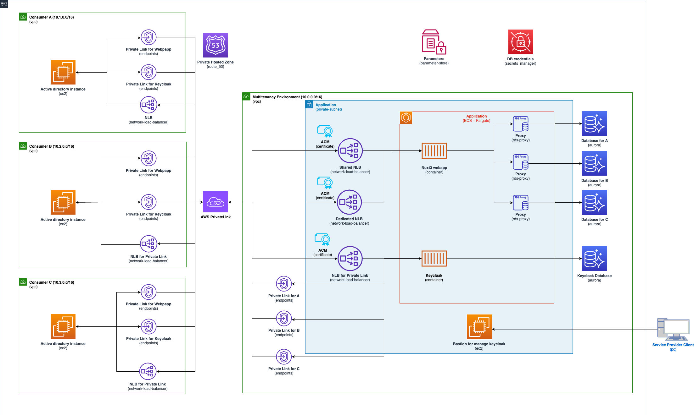

# Multi-tenancy application using Keycloak in a closed network

Multi-tenancy strategies have the various isolation concepts like [silo](https://docs.aws.amazon.com/wellarchitected/latest/saas-lens/silo-isolation.html),
[pool](https://docs.aws.amazon.com/wellarchitected/latest/saas-lens/pool-isolation.html) and [bridge](https://docs.aws.amazon.com/wellarchitected/latest/saas-lens/bridge-model.html) model.
Depending on the requirements, the application may require a closed network environment, such as the government systems and high secure systems.
This sample can deploy the multi-tenancy application including consumer environments on a closed network. This application isolation concept is like the bridge model. The web and app tier are shared, but the database tier as a silo model is deployed in each tenant. The web application including API created with [Nuxt](https://nuxt.com/) is deployed on [Amazon ECS](https://aws.amazon.com/ecs/?nc1=h_ls) as a container. Also, this application uses [Keycloak](https://www.keycloak.org/) deployed on Amazon ECS to authenticate the users with LDAP federation via [AWS PrivateLink](https://aws.amazon.com/privatelink/?nc1=h_ls).

## Architecture



### Mulite-tenancy enviroment

This enviroment creates the web application and Keycloak as the authentication. Both applications are deployed on Amazon ECS as a container, and these databases are deployed on [Amazon Aurora Serverless v2](https://docs.aws.amazon.com/AmazonRDS/latest/AuroraUserGuide/aurora-serverless-v2.html). Each consumer environment can access to these applicaton via Amazon PrivateLink and [Network Load Balancer](https://docs.aws.amazon.com/elasticloadbalancing/latest/network/introduction.html)(NLB). In case of enabling dedicated in a consumer enrivoment(Consumer C environment enables dedicated as default), the consumer enviroment accesses to the web application via the dedicated NLB (Other enviroments use the shared NLB).

- Nuxt: [3.8.2](https://github.com/nuxt/nuxt/releases/tag/v3.8.2)
- Keycloak: [22.0.5](https://www.keycloak.org/2023/10/keycloak-2205-released.html)

### Consumer enviroment

This enviroment creates single instance for Active directory on each Amazon VPC. Need to setup Active Directory Domain Services (AD DS) and DNS via [AWS Systems Manager Fleet Manager](https://docs.aws.amazon.com/systems-manager/latest/userguide/fleet.html). Please read the following [AD setup in each instance](#AD-setup-in-each-instance).

## Prerequisites

- Create AWS Account
- Setup AWS CLI and profile
- Install Docker Desktop
- Install Node.js >= `18.18.2`
- Createing and importing the following certificates in AWS Certificate Manager (ACM). Please see [Importing certificates into AWS ACM](https://docs.aws.amazon.com/acm/latest/userguide/import-certificate.html) if you need.
  - Keycloak (`keycloak.multitenancy.com`)
  - Keycloak for Admin console(`admin.keycloak.multitenancy.com`)
  - Web application
    - Shared NLB (`*.nuxt3.keycloak.multitenancy.com`)
    - Dedicated NLB (`c-corp.keycloak.multitenancy.com`)

## Setup

### Config file

At first, add your aws profile to `profile` in [cdk.json](cdk.json).

Change the following values in [config.ts](config.ts) as you need before executing the deployment command.
Important thing is you need to change the values of `acmCertificateArn` to your arn of ACM in `keyCloakApp` and `nuxtApp`.

Please see the [config doc](docs/config.md) if you check the properties in detail.

### Nuxt3

Depending your `zoneName`, change the `authUrl` like `https://keycloak.yourZoneName` in the [nuxt.config.ts](docker/nuxtjs/nuxt3-project/nuxt.config.ts).

```ts
runtimeConfig: {
    public: {
      authUrl: 'https://keycloak.multitenancy.com',
      stripeKey: '',
    }
```

## Deployment

1. Install the dependencies

```zsh
npm ci
```

> #### Note
>
> Execute the follwing `bootstrap` command if you deploy it for the first time. Please see [Boostrapping](https://docs.aws.amazon.com/cdk/v2/guide/bootstrapping.html).
>
> ```zsh
> npm run cdk bootstrap
> ```

2. Deploy AWS resources

```zsh
npm run cdk deploy
```

## Database migration

You can see `migrationLambdaCommand` in the Outputs as follows after deployoing it.

```zsh
aws lambda invoke --function-name MigrationLambda-lambda --cli-binary-format raw-in-base64-out file://lambda/payload.json response.json --profile <Your profile>
```

To invoke the above lambda command, you can create the `posts` table and insert dummy data into the table in the database as this sample has the lambda function for migration database and dummy data.

## Certificates registration in each instance

Register the certificates in each instance as follows

- `keycloak-manage-instance`
  - Keycloak (`keycloak.multitenancy.com`)
  - Keycloak for Admin console(`admin.keycloak.multitenancy.com`)
- `a-corp-ad-demo`
  - Keycloak (`keycloak.multitenancy.com`)
  - Shared NLB (`*.nuxt3.keycloak.multitenancy.com`)
- `b-corp-ad-demo`
  - Keycloak (`keycloak.multitenancy.com`)
  - Shared NLB (`*.nuxt3.keycloak.multitenancy.com`)
- `c-corp-ad-demo`
  - Keycloak (`keycloak.multitenancy.com`)
  - Dedicated NLB (`c-corp.keycloak.multitenancy.com`)

## AD setup in each instance

Setup Active Directory Domain Services (AD DS) and DNS with `Server Manager`. Also,setup domain controller.
After completing the setup, add users with `Active Directory Users and Computers`. Important thing is to add `keycloak` as a user for ldap authentication with Keycloak.

## Keycloack setup

### Access to Keycloak Admin Console

You can access to the admin console in Keycloak via `keycloak-manage-instance` instance with Fleet Mangaer. Using the keypair of `KeyclaokManagedInstanceKeyId` in the Outputs and connecting the instance.
Keycloak admin username and password are stored in AWS Secrets Manater, so please copy and use these secrets from accessing to `KeycloakAdmin` in the Secrets Manager.

### Realm and client ID

Craete a Realm and Client using the `name` of `CorpList` as follows.

- Set `name-auth`as Realm ID
- Set `name-webapp` as Client ID.

(e.g. `a-corp-auth` and `a-corp-webapp` if you define the name of `CorpList` as `a-corp`)
You can also change these IDs as you like by configuring the `initOptions` in [keycloak.client.ts](docker/nuxtjs/nuxt3-project/plugins/keycloak.client.ts)

```ts
const initOptions: KeycloakConfig = {
  url: runtimeConfig.public.authUrl,
  realm: `${subDomain}-auth`,
  clientId: `${subDomain}-webapp`,
};
```

### User federation with LDAP

Need to fill the DNS name of the vpc endpoint in `Connection URL` to setup LDAP in Keycloak. You can use the DNS name of `KeycloakLdapForXXX` in the Outputs as follows.

```zsh
your-alias-dev-multitenant-app-InfraStack.KeycloakLdapForACorp = vpce-xxxx.vpce-svc-xxxxx.ap-northeast-1.vpce.amazonaws.com
your-alias-dev-multitenant-app-InfraStack.KeycloakLdapForBCorp = vpce-yyyy.vpce-svc-yyyy.ap-northeast-1.vpce.amazonaws.com
your-alias-dev-multitenant-app-InfraStack.KeycloakLdapForCCorp = vpce-zzzz.vpce-svc-zzzz.ap-northeast-1.vpce.amazonaws.com
```

## Destroy

```zsh
npm run cdk destroy
```

# Security

See [CONTRIBUTING](CONTRIBUTING.md#security-issue-notifications) for more
information.

## License

This code is licensed under the MIT-0 License. See the [LICENSE](LICENSE) file.
